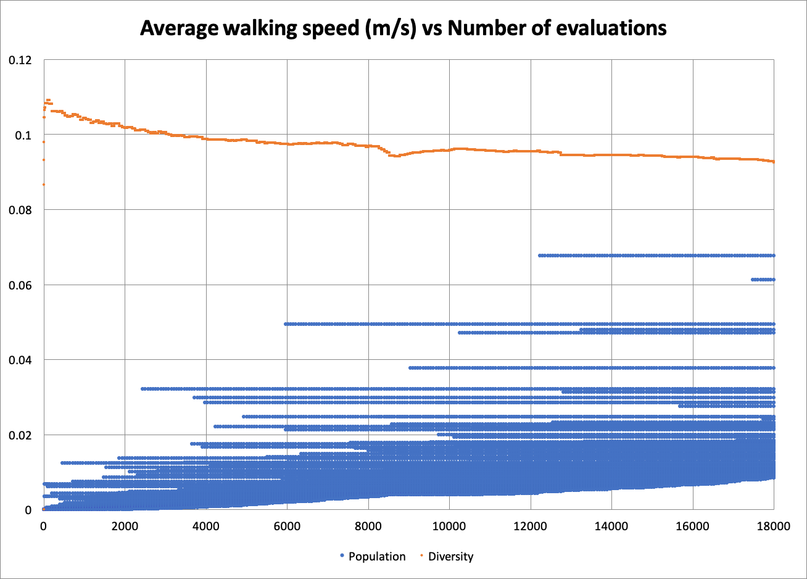
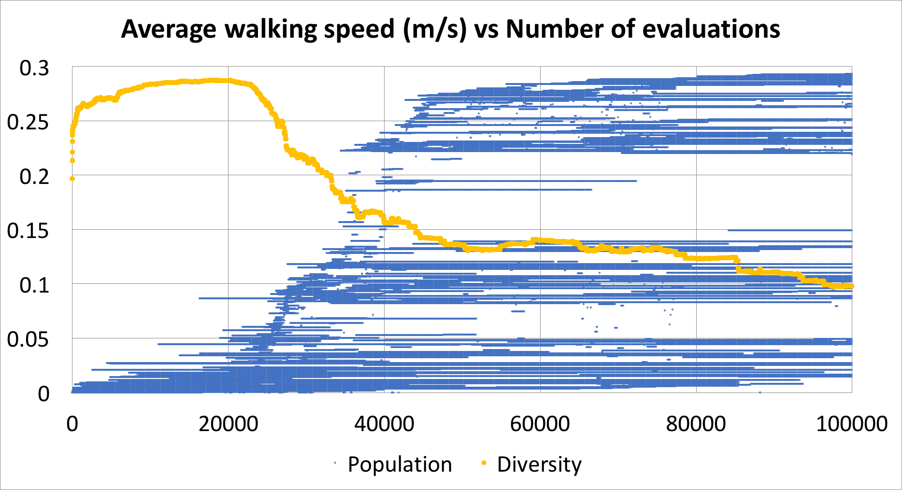
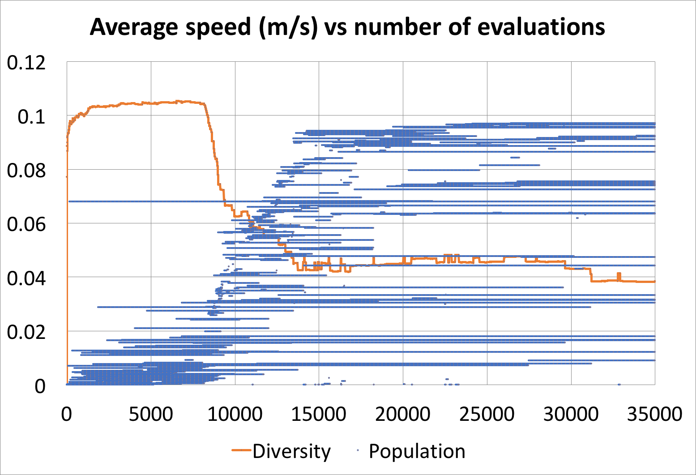
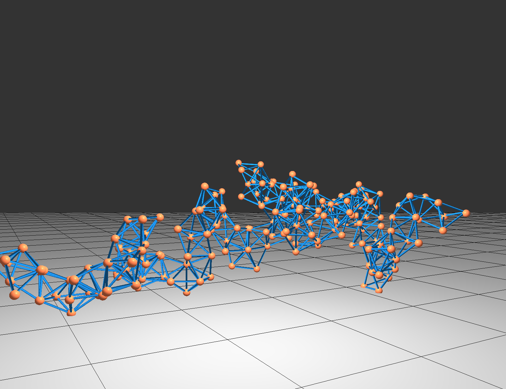
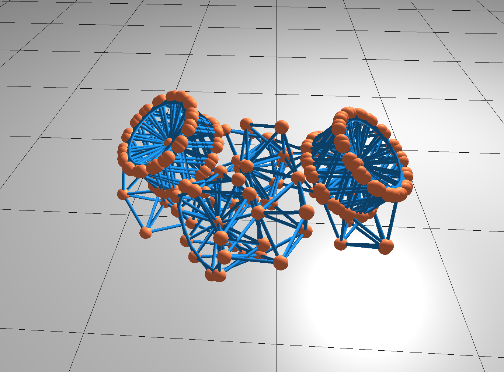
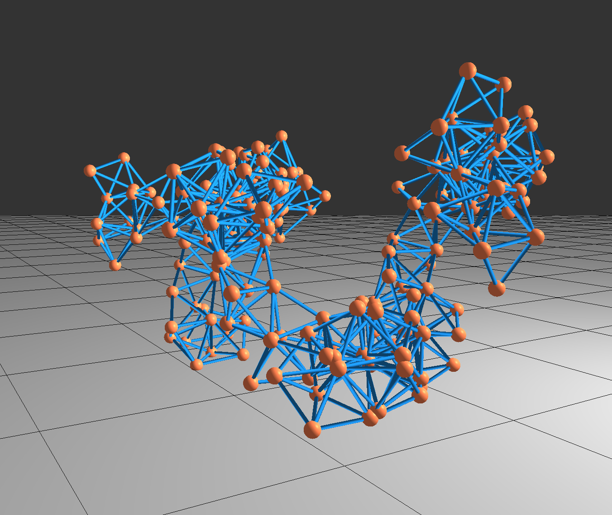

# WalkingRobots

My goal is to develop a spring-mass system that can walk. Each time-step, I alter the rest-lengths of each spring in the system, causing the springs to actuate and the whole system to move in some way.

## Gifs

I started by actuating the springs using sine waves as a function of time.

Then, I introduced a neural network to actuate the springs, based on their current lengths at the start of the time-step. The network was trained using evolutionary computation, but there were many issues with the solutions involving "mechanical snaps".

After those issues were resolved, the network started to learn that vibrating was an effective tactic.

After adding additional incentives to avoid these "hacky" solutions, the network literally invented the wheel.

## Reports

In order for the computation to learn the best neural network to actuate the springs, I crossover and mutate pairs of existing networks in order to breed the best offspring. Afterwards, I sort the population and keep only the top scoring members. 

In my first attempt, I simply sort the population of networks by the speed they were able to achieve. However, this led to a lack of diversity in the populaiton, and stunted growth. Please note that "diversity" was measured using the average l2 norm of the weights of pairs in the population, and their values are scaled down arbitrarily to fit into the following population graphs. They are important for viewing the diversity trend.

I then tried using both speed and age as simulataneous objective functions to encourage the survival of innovative new networks. To sort the population by these two objectives, I used the [NSGA-ii](https://pdfs.semanticscholar.org/bcd2/9e88011498519269da020fb91b759f00d701.pdf) sorting algorithm. This approach yielded more diversity and better results overall.

Typically, there would be a sudden "breakthrough" when one network was able to vastly outperform the others. Can you spot when it occurs?

## Coming soon

Currently, my efforts are focused on generating an optimal morphology in parallel with generating the best neural network for actuating the springs. I have designed a system that generates a morphology based on a set of finite-state-machine rules. Here are some of the creations.

These robots have many more springs than the previous spring-mass systems, so I will use CUDA on GPU to help train the system efficiently.
